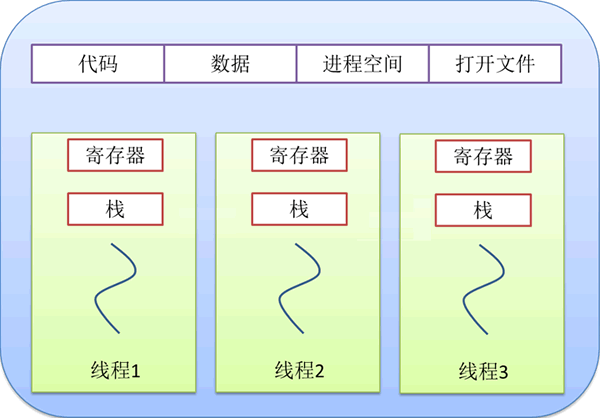

# pthread 多线程

### 什么是线程

```
线程对应的英文名称为"thread"，它的功能是执行应用程序中的某个具体任务，比如一段程序、一个函数等
每个进程执行前，操作系统都会为其分配所需的资源，包括要执行的程序代码、数据、内存空间、文件资源等。一个进程至少包含 1 个线程，可以包含多个线程，所有线程共享进程的资源，各个线程也可以拥有属于自己的私有资源。
进程仅负责为各个线程提供所需的资源，真正执行任务的是线程，而不是进程

```

### 进程与线程之间的关系如下图



### 第一个线程

**[示例代码](00_first_thread/thread.c)**

### 创建线程

**[示例代码](01_create_thread/thread.c)**

### 终止线程

**[示例代码](02_exit_thread/thread.c)**

**[示例代码](03_cancel_thread/thread.c)**

1. 执行完毕，自行终止
2. 执行过程中遇到pthread_exit()或return 终止
3. 执行过程中，接收其他线程"终止执行"信号，终止

### 获取线程函数的返回值

```
对于一个默认属性的线程 A 来说，线程占用的资源并不会因为执行结束而得到释放。
而通过在其它线程中执行pthread_join(A,NULL);语句，可以轻松实现“及时释放线程 A 所占资源”的目的。
一个线程执行结束的返回值只能由一个 pthread_join() 函数获取，当有多个线程调用 pthread_join() 函数获取同一个线程的执行结果时，哪个线程最先执行 pthread_join() 函数，执行结果就由那个线程获得，其它线程的 pthread_join() 函数都将执行失败。
```

**[示例代码]()**

### 终止线程执行的坑

```
对于默认属性的线程，当有线程借助 pthread_cancel() 函数向它发送 Cancel 信号时，它并不会立即结束执行，而是选择在一个适当的时机结束执行。

所谓适当的时机，POSIX 标准中规定，当线程执行一些特殊的函数时，会响应 Cancel 信号并终止执行，比如常见的 pthread_join()、pthread_testcancel()、sleep()、system() 等，POSIX 标准称此类函数为“cancellation points”（中文可译为“取消点”）。
<pthread.h> 头文件还提供有 pthread_setcancelstate() 和 pthread_setcanceltype() 这两个函数，我们可以手动修改目标线程处理 Cancel 信号的方式。
```

**[示例代码](05_trick_cancel_thread/thread.c)**

### 线程同步机制

```
我们通常将“多个线程同时访问某一公共资源”的现象称为“线程间产生了资源竞争”或者“线程间抢夺公共资源”，线程间竞争资源往往会导致程序的运行结果出现异常，感到匪夷所思，严重时还会导致程序运行崩溃。

幸运地是，Linux 提供了很多种解决方案，确定各个线程可以同步访问进程提供的公共资源（简称“线程同步”）。
所谓线程同步，简单地理解就是：当一个线程访问某公共资源时，其它线程不得访问该资源，它们只能等待此线程访问完成后，再逐个访问该资源。

Linux 环境中，实现线程同步的常用方法有 4 种，分别称为互斥锁、信号量、条件变量和读写锁。

```

**[示例代码](06_sync_thread/thread.c)**

### 使用互斥锁实现线程同步

```
互斥锁（Mutex）又称互斥量或者互斥体，是最简单也最有效地一种线程同步机制。互斥锁的用法和实际生活中的锁非常类似，当一个线程访问公共资源时，会及时地“锁上”该资源，阻止其它线程访问；访问结束后再进行“解锁”操作，将该资源让给其它线程访问。
```

**[示例代码]()**

### 使用信号量实现线程同步

```
信号量又称“信号灯”，主要用于控制同时访问公共资源的线程数量，当线程数量控制在 ≤1 时，该信号量又称二元信号量，功能和互斥锁非常类似；当线程数量控制在 N（≥2）个时，该信号量又称多元信号量，指的是同一时刻最多只能有 N 个线程访问该资源。
```

**[示例代码](08_semaphore_thread/thread.c)**

### 使用条件变量实现线程同步

```
条件变量的功能类似于实际生活中的门，门有“打开”和“关闭”两种状态，分别对应条件变量的“成立”状态和“不成立”状态。当条件变量“不成立”时，任何线程都无法访问资源，只能等待条件变量成立；一旦条件变量成立，所有等待的线程都会恢复执行，访问目标资源。为了防止各个线程竞争资源，条件变量总是和互斥锁搭配使用。
条件变量本质也是一个全局变量，它的功能是阻塞线程，直至接收到“条件成立”的信号后，被阻塞的线程才能继续执行
```

**[示例代码](09_condition_thread/thread.c)**

### 使用读写锁实现线程同步

```
多线程程序中，如果大多数线程都是对公共资源执行读取操作，仅有少量的线程对公共资源进行修改，这种情况下可以使用读写锁解决线程同步问题。
本质上，读写锁就是一个全局变量，发出读请求和写请求的线程都可以访问它。为了区别线程发出的请求类别，当读写锁被发出读请求的线程占用时，我们称它为“读锁”；当读写锁被发出写请求的线程占用时，称它为“写锁”。
```

| 当前读写锁的状态 | 线程发出“读”请求 | 线程发出“写”请求 |
| ---------------- | ------------------ | ------------------ |
| 无锁             | 允许占用           | 允许占用           |
| 读锁             | 允许占用           | 阻塞线程执行       |
| 写锁             | 阻塞线程执行       | 阻塞线程执行       |

**[示例代码](10_read_write_lock_thread/thread.c)**

### 避免线程发生死锁

**[示例代码]()**

### 线程属性（自定义线程属性）

**[示例代码]()**

### 使用C++11进行多线程编程

**[示例代码]()**

### 将Linux多线程程序移植到Windows

**[示例代码]()**
